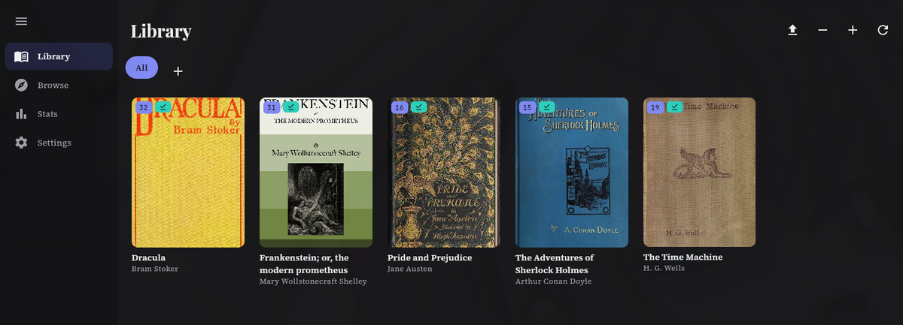
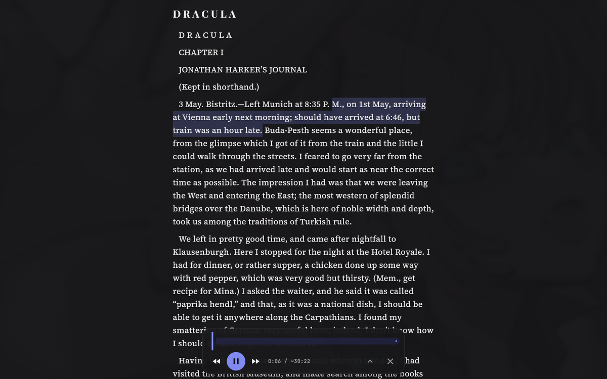
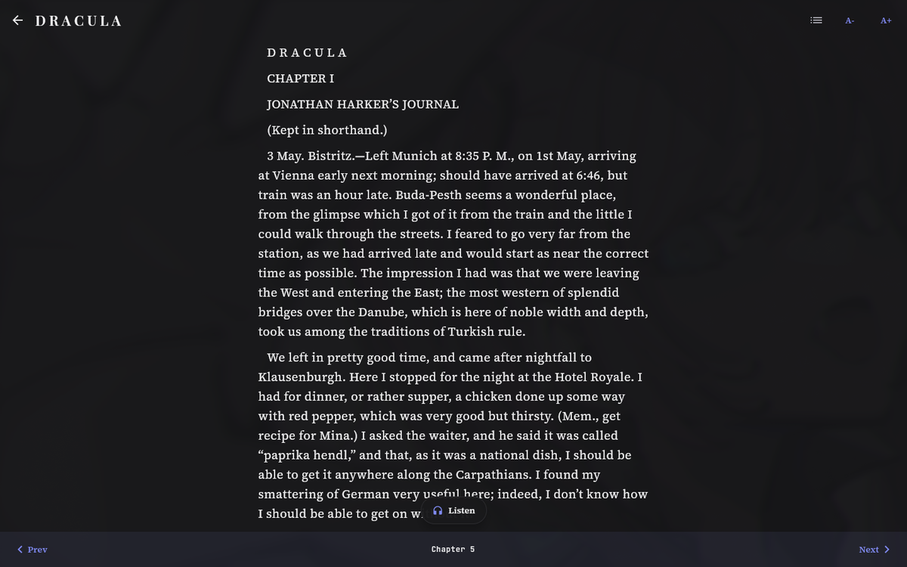
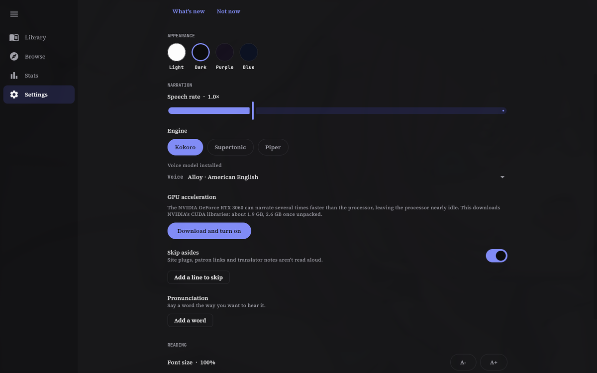

# NovelScraper

**A web novel reader for Android, Linux and Windows.**

The library stays on the device, reads offline, and narrates itself
with voices that never leave the machine.

<table>
<tr>
<td width="33%"></td>
<td width="33%"></td>
<td width="33%"></td>
</tr>
<tr>
<td align="center"><b>Narration, following the sentence</b></td>
<td align="center"><b>The reader</b></td>
<td align="center"><b>Voices, all on device</b></td>
</tr>
</table>

Shown with public-domain books from Project Gutenberg. The app ships with no
sources and no content of its own.

A Windows build with a terminal attached is on the
[releases page](https://github.com/mtgims/NovelScraper/releases) as well, worth having only to see why a crash happened.
There is no iOS or macOS build: they cannot be tested without the hardware, and
an untested build is worse than none. Anyone able to test one is welcome to
contribute it.

---

## What it does

- **Reads from sources.** Sources are extensions, and the app ships with none:
  add a repository, install the sources wanted, then browse, search and read
  from those sites over the device's own connection.
- **Keeps a library on the device.** Novels, chapter lists, progress, ratings
  and collections live in SQLite on the phone or the computer. Download keeps a
  novel's chapters for reading and listening offline.
- **Typeset reader.** A choice of font, size and line spacing. It remembers the
  position in each chapter, restores it after images and fonts settle, and marks
  chapters read as they are finished.
- **Narrates.** Kokoro, Supertonic and Piper, all running locally through sherpa-onnx, with
  gapless playback across chapters, a sleep timer, a pronunciation dictionary,
  and audio export to WAV. Android plays in the background and on the lock
  screen; Linux answers the keyboard's media keys through MPRIS.
- **Answers browser checks.** Sources behind Cloudflare or DDoS-Guard are
  fetched through a real browser: the phone's WebView, or on Linux the browser
  already installed (Chromium, Brave, Chrome, Edge or Vivaldi), driven in a
  profile of the app's own. A check that needs a person brings its window
  forward and goes away again afterwards.

[`app/CHANGELOG.md`](app/CHANGELOG.md) tracks every version.

## Installing it

Every version is published on the
[releases page](https://github.com/mtgims/NovelScraper/releases).
You can find there the APK, AppImage and Windows Installer. 

## Sources

Sources live in their own repository,
[novelscraper-extensions](https://github.com/mtgims/novelscraper-extensions),
which also explains how to write one. The app ships with none: under Browse,
Extensions, Repositories, add that repository's index, or LNReader's, or any
index in the same format, then install what is wanted.

Plugins run in QuickJS inside the app; the JavaScript host they run against
lives in `app/composeApp/pluginHost/`.

## Sync

The app doesn't need an account. Though if you create one you can sync between devices.

## Cloudflare

Several sources are protected by Cloudflare and can block you more than needed if you are using a VPN. You can always pass the captcha in the webview browser.

## Licence

NovelScraper is free software under the **GNU General Public License, version 3
or later**. The full text is in [LICENSE](LICENSE).

In short: it may be used, studied, changed and shared by anyone. Anything built
on it and passed on has to stay free software under the same licence, source
included. That is deliberate. A reader people install and trust should not be
able to come back to them as a closed build with advertising or tracking bolted
on, and copyleft is what makes that a licence violation rather than someone
else's business model.

Contributions are accepted on the same terms.
